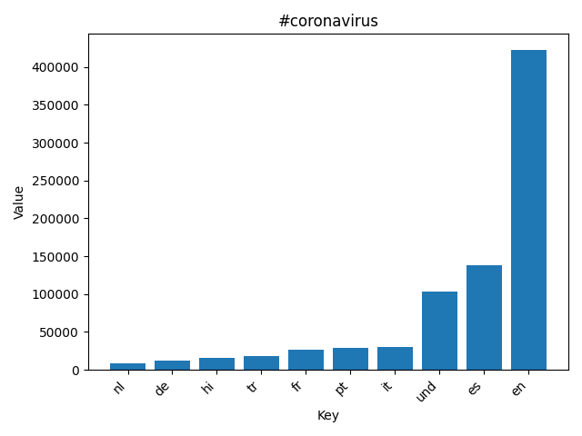
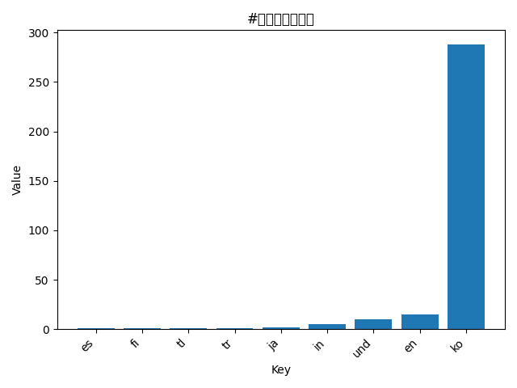
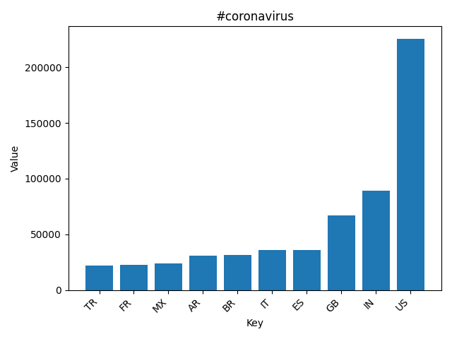
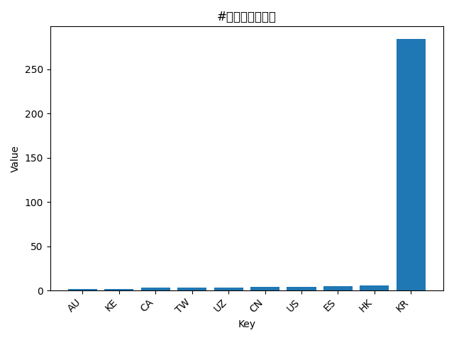
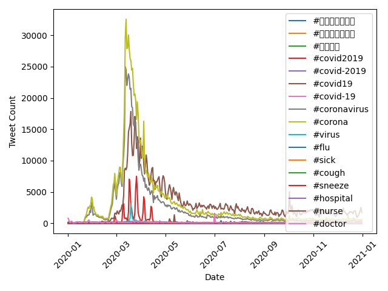

# Coronavirus Twitter Analysis

This project analyzes over 1 billion geotagged tweets from 2020 to track the spread of coronavirus on social media. All processing was run on the **Claremont McKenna College Lambda server** using Python and MapReduce-style parallelization.

## Workflow

1. **Map**  
   Each tweet was scanned for hashtags and counted by language and country. The mapper outputs `.lang` and `.country` files in the `outputs/` folder. Processing used background jobs with `nohup` for parallel execution.

2. **Reduce**  
   The outputs from the mapper were combined into single files for languages and countries, summing counts across all days.

3. **Visualize**  
   Top counts for each hashtag were plotted as bar charts. Horizontal axis = key (language or country), vertical axis = tweet counts. Only the top 10 keys are included.

     
   *Bar chart showing the top 10 languages for tweets containing #coronavirus.*

     
   *Bar chart showing the top 10 languages for tweets containing #코로나바이러스.*

     
   *Bar chart showing the top 10 countries tweeting #coronavirus.*

     
   *Bar chart showing the top 10 countries tweeting #코로나바이러스.*

4. **Alternative Reduce**  
   Line plots show hashtag activity over time. Each line represents a hashtag, x-axis = day of year, y-axis = number of tweets.

     
   *Line plot showing daily tweet counts for tracked hashtags throughout 2020.*

## Notes

- Non-Latin hashtags (Korean, Japanese, Chinese) required fonts were not available on the server.
